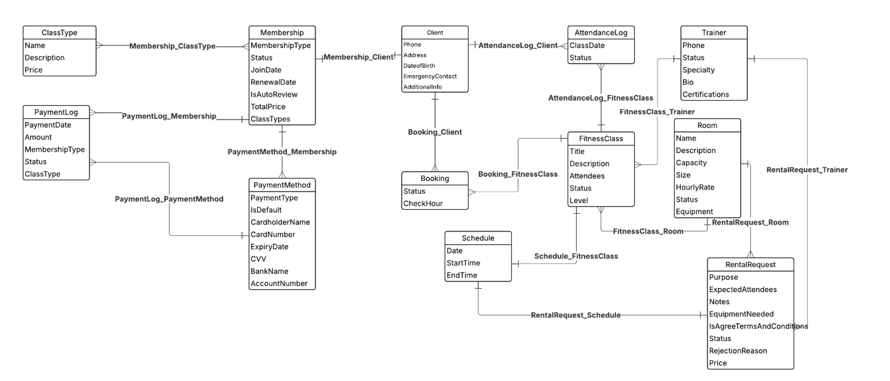
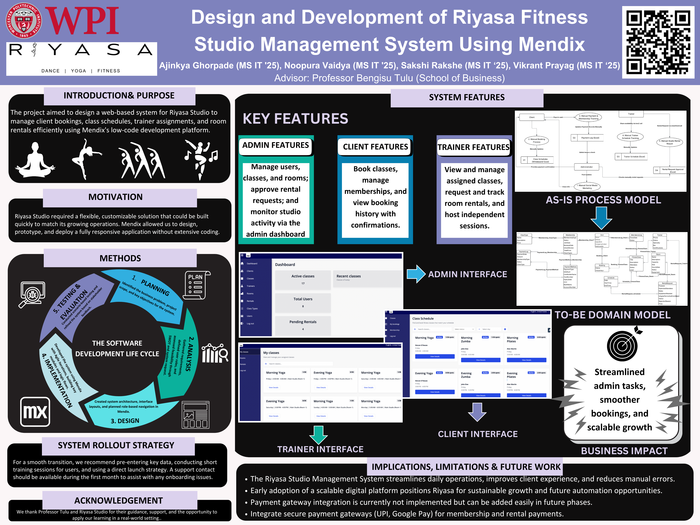

# Riyasa Fitness Studio – System Design & Development  

This project is a **system design and prototype** for **Riyasa Fitness Studio**, developed as part of MIS573 coursework. The project includes:  

- Backend system design  
- Low-code frontend development using **Mendix**  
- Domain model, requirements, and working prototype  

👉 Studio reference site: [Riyasa Studios](https://www.riyasastudios.com)  

---

## 📌 Project Files  

- **SystemDesignDevelopment.docx** – Full project report  
- **DomainModel.png** – Domain model diagram  
- **MIS573_Group3_Poster.png** – Poster summarizing the project  
- **Prototype (Mendix)** – Fully functional demo application  

---

## 🖼️ Project Visuals  

### Domain Model  

  

  

### Project Poster  

  

  

---

## 🚀 Prototype Access (Mendix)  

🔗 [Live Prototype – Riyasa Fitness Studio](https://riyasa-fitnessstudioapp-sandbox.mxapps.io/index.html?profile=Responsive)  

### Login Credentials  

**Admin**  
- Username: `demo_administrator`  
- Password: `Abc1234567890`  

**Client**  
- Username: `ajinkyagh@gmail.com`  
- Password: `Abc1234567890`  

**Trainer**  
- Username: `stevan@gmail.com`  
- Password: `Abc1234567890`  

---

## 📄 Project Report  

The full project details, including requirements, system design, and implementation, can be found in:  
- [SystemDesignDevelopment.docx](SystemDesignDevelopment.docx)  

